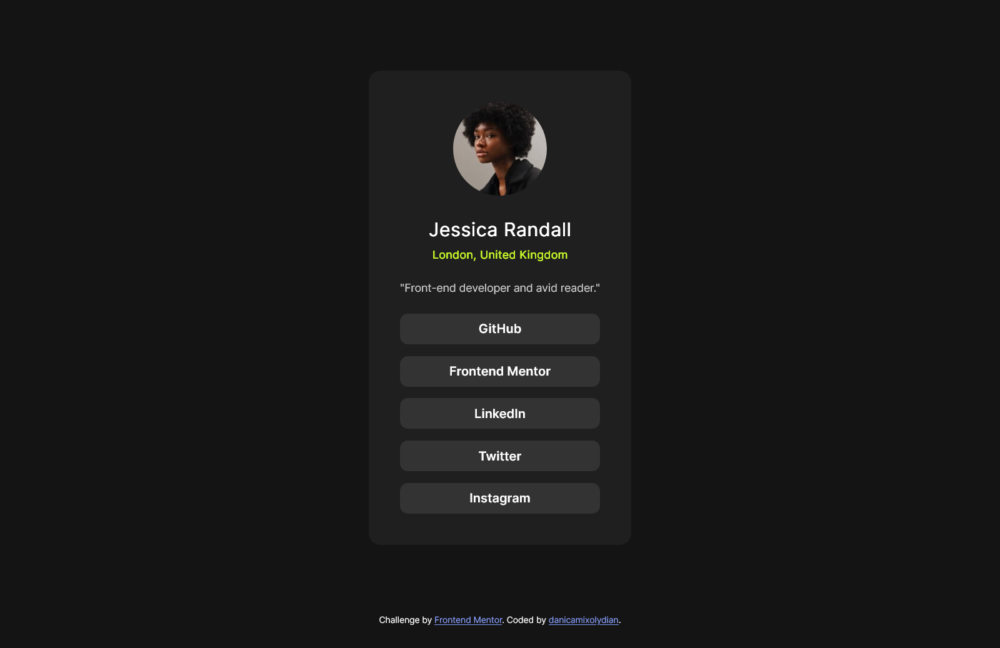

# Frontend Mentor - Social links profile solution

This is a solution to the [Social links profile challenge on Frontend Mentor](https://www.frontendmentor.io/challenges/social-links-profile-UG32l9m6dQ). Frontend Mentor challenges help you improve your coding skills by building realistic projects.

## Table of contents

- [Overview](#overview)
  - [The challenge](#the-challenge)
  - [Screenshot](#screenshot)
  - [Links](#links)
- [My process](#my-process)
  - [Built with](#built-with)
  - [What I learned](#what-i-learned)
  - [Useful resources](#useful-resources)
- [Author](#author)

## Overview

### The challenge

Users should be able to:

- See hover and focus states for all interactive elements on the page

### Screenshot

### Links

- Solution URL: [https://github.com/danicamixolydian/FrontendMentor-Challenges/tree/main/02-social-links-profile](https://github.com/danicamixolydian/FrontendMentor-Challenges/tree/main/02-social-links-profile)
- Live Site URL: [https://danicamixolydian.github.io/FrontendMentor-Challenges/](https://danicamixolydian.github.io/FrontendMentor-Challenges/)

## My process

### Built with

- Semantic HTML5 markup
- CSS custom properties
- CSS transition property
- CSS transform property
- Flexbox
- CSS Grid
- Media queries
- Desktop-first workflow

### What I learned

- The four states of anchor tag: link, visited, hover, active
- CSS transition property
- CSS transform property

### Useful resources

- [How to include a font ttf using CSS?](https://www.geeksforgeeks.org/css/how-to-include-a-font-ttf-using-css/)
- [How to make your website responsive using media queries in CSS?](https://www.youtube.com/watch?v=UUjNEMXZA-k&t=2s)

## Author

- Frontend Mentor - [@danicamixolydian](https://www.frontendmentor.io/profile/danicamixolydian)
